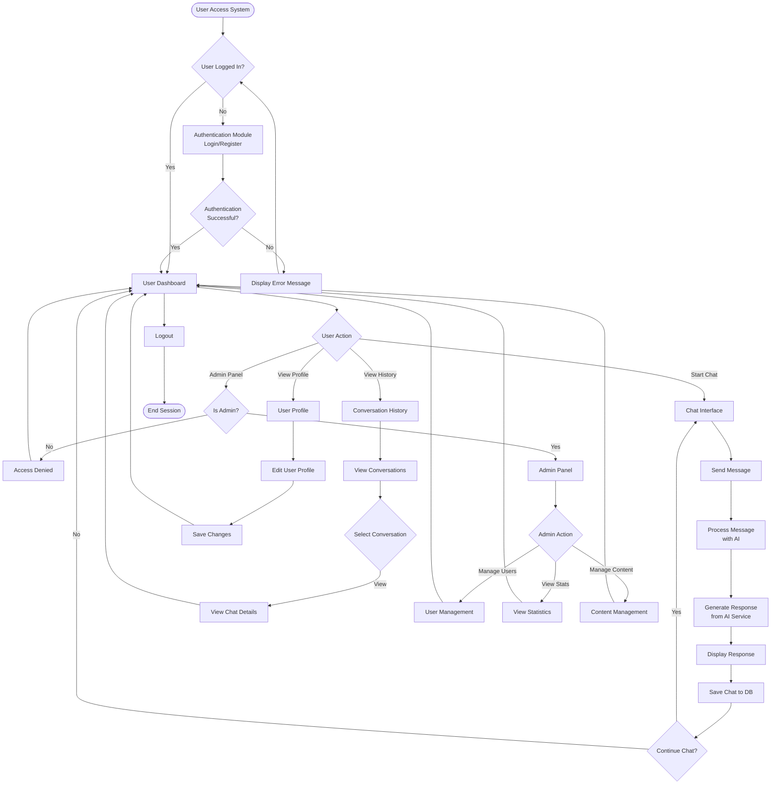
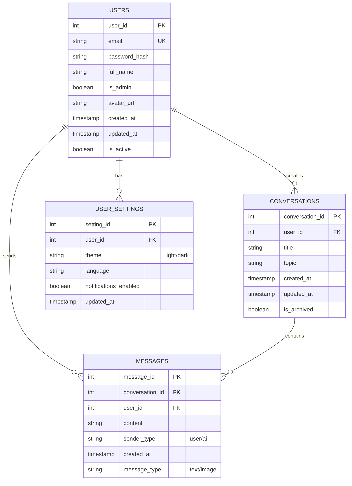
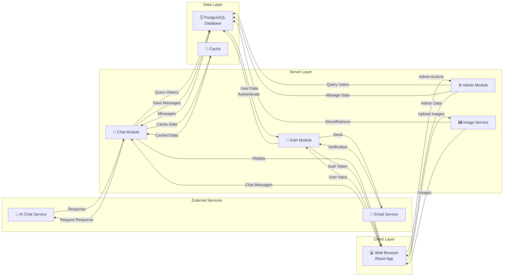
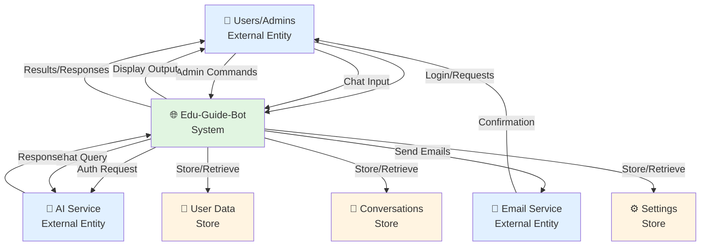
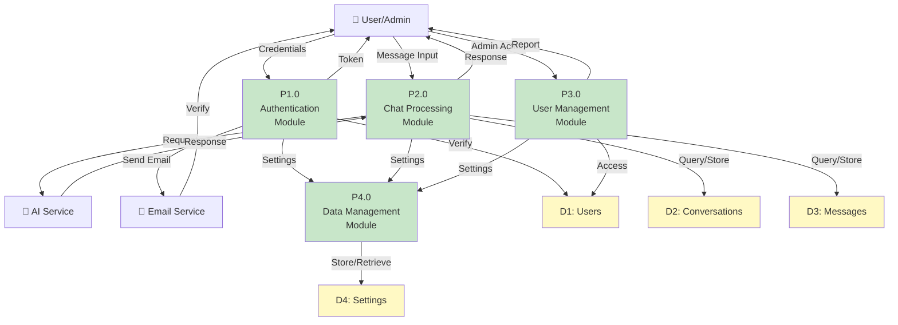
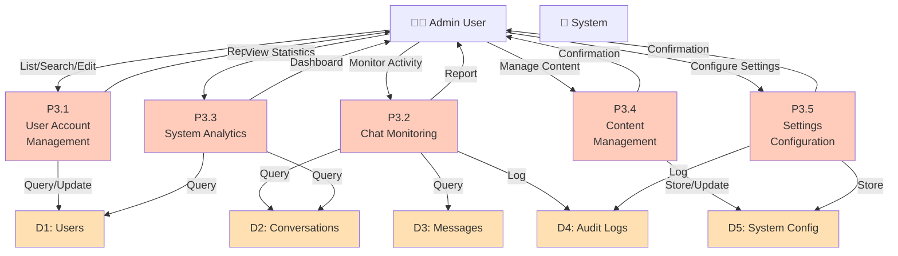
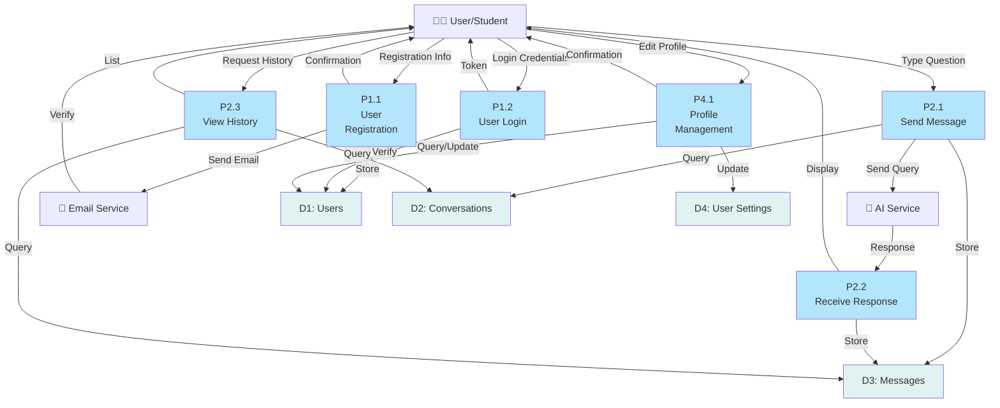

# Edu-Guide-Bot - Mermaid Diagram Codes

This file contains all Mermaid diagram codes for the project. These can be copied and pasted into any Mermaid viewer or editor.

---

## 1. SYSTEM FLOWCHART

---

## 2. ER DIAGRAM

---

## 3. DATA FLOW DIAGRAM (System Overview)

---

## 4. ZERO LEVEL DFD (Context Diagram)

---

## 5. FIRST LEVEL DFD (Main Processes)

---

## 6. FIRST LEVEL DFD - ADMIN SIDE

---

## 7. FIRST LEVEL DFD - USER/STUDENT SIDE

---

## How to Use These Diagrams

1. **Copy** the complete mermaid code block (including the three backticks)
2. **Paste** into a Mermaid live editor: https://mermaid.live
3. **Modify** as needed
4. **Export** as PNG or SVG for presentations/documents

### Online Mermaid Editors:
- Mermaid Live: https://mermaid.live
- GitHub (paste in markdown): https://github.com
- VS Code with extension: Markdown Preview Mermaid Support

### Export Options:
- Export as PNG/SVG from Mermaid Live
- Screenshot for quick use
- Embed in office documents
- Include in PowerPoint presentations

---

## Notes for Submission

- All diagrams follow standard DFD and ER notation
- Color coding helps distinguish between different components
- Diagrams are suitable for academic and professional documentation
- Can be easily modified to reflect system changes
- Include these in your project documentation submission
