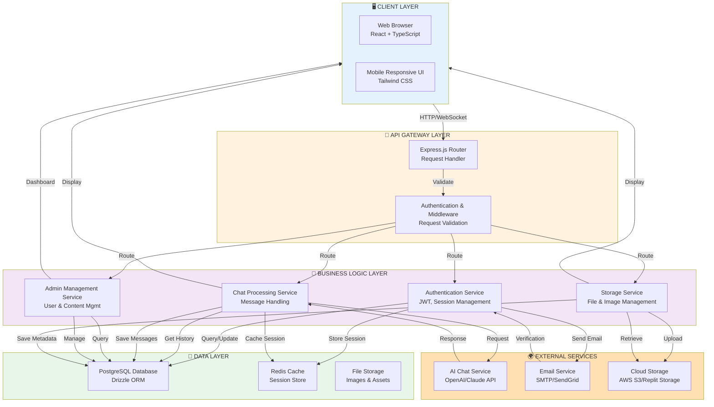
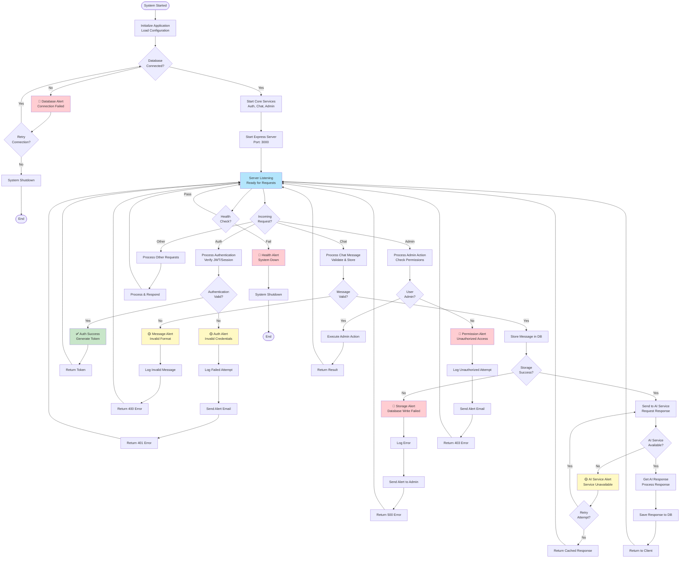
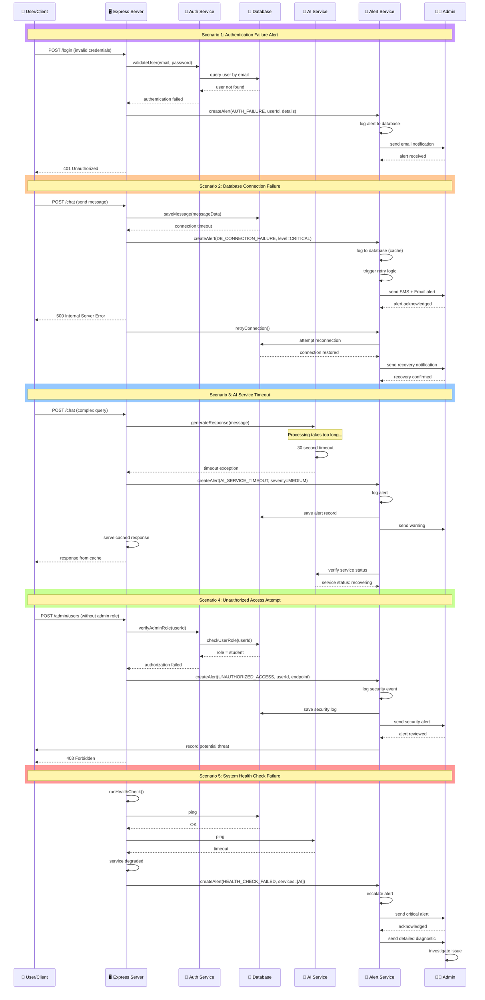
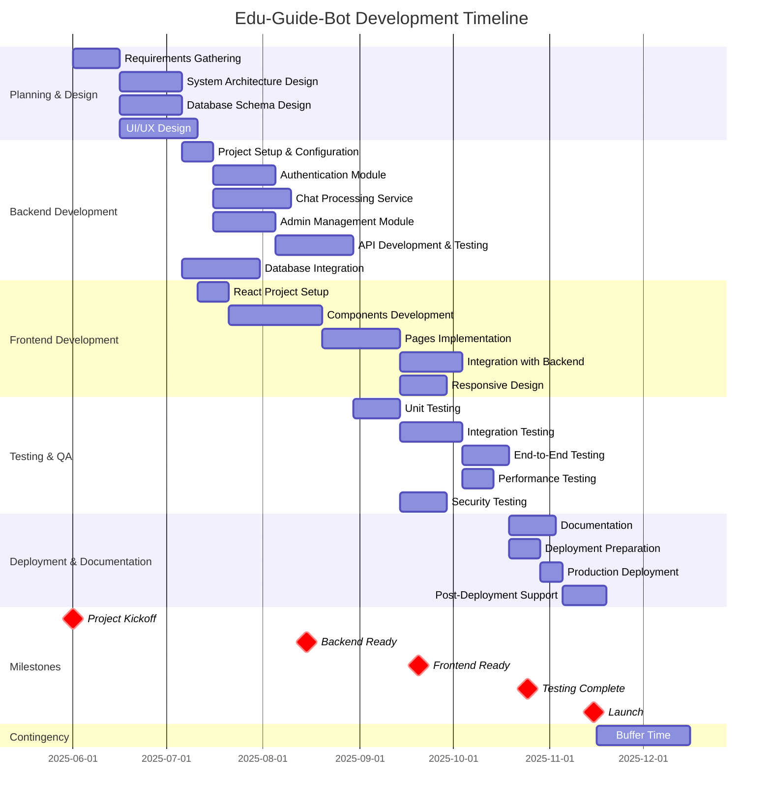
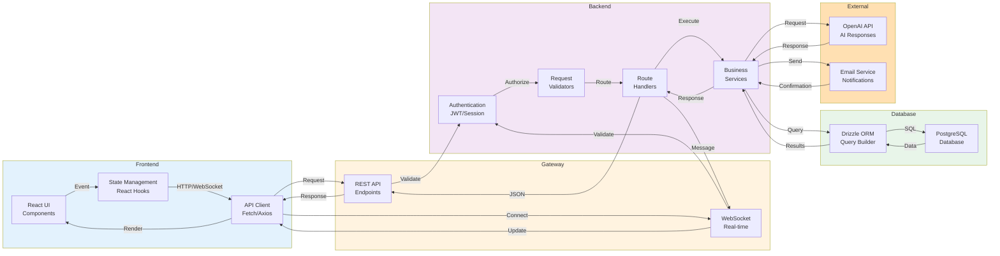
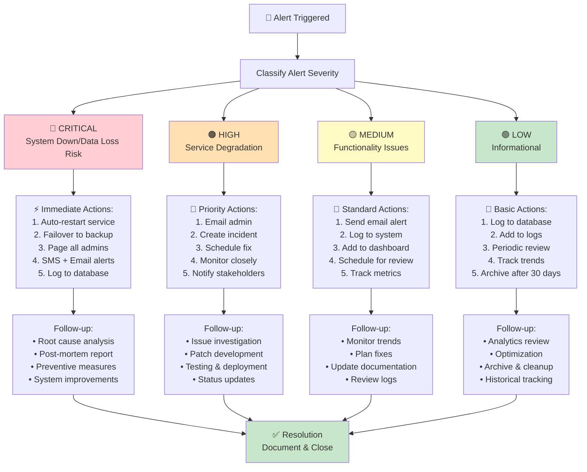

# Edu-Guide-Bot - High-Level System Architecture & Advanced Diagrams

## Overview
This document contains advanced system architecture diagrams, use case scenarios, alert flows, and project timeline for the Edu-Guide-Bot system.

---

## 1. HIGH LEVEL SYSTEM ARCHITECTURE



---

## 2. USE CASE DIAGRAM

```mermaid
graph TB
    Student["👨‍🎓 Student User"]
    Admin["👨‍💼 Admin User"]
    System["🌐 Edu-Guide-Bot<br/>System"]
    AIService["🤖 AI Service"]
    
    subgraph StudentUseCases["Student Use Cases"]
        REG["Register Account"]
        LOGIN["Login to System"]
        CHAT["Send Chat Messages"]
        VIEW_HIST["View Chat History"]
        SEARCH["Search Conversations"]
        EDIT_PROFILE["Edit User Profile"]
        MANAGE_SETTINGS["Manage Settings"]
        LOGOUT["Logout"]
    end
    
    subgraph AdminUseCases["Admin Use Cases"]
        VIEW_USERS["View All Users"]
        MANAGE_USERS["Manage User Accounts"]
        VIEW_ANALYTICS["View Analytics"]
        MONITOR_CHATS["Monitor Chats"]
        MANAGE_CONTENT["Manage AI Content"]
        SYSTEM_CONFIG["Configure System"]
        VIEW_LOGS["View Audit Logs"]
    end
    
    subgraph SystemFunctions["System Functions"]
        PROCESS_MSG["Process Message"]
        GENERATE_RESP["Generate Response"]
        STORE_DATA["Store Data"]
        VALIDATE_AUTH["Validate Authentication"]
        SEND_EMAIL["Send Notifications"]
    end
    
    Student --> REG
    Student --> LOGIN
    Student --> CHAT
    Student --> VIEW_HIST
    Student --> SEARCH
    Student --> EDIT_PROFILE
    Student --> MANAGE_SETTINGS
    Student --> LOGOUT
    
    Admin --> VIEW_USERS
    Admin --> MANAGE_USERS
    Admin --> VIEW_ANALYTICS
    Admin --> MONITOR_CHATS
    Admin --> MANAGE_CONTENT
    Admin --> SYSTEM_CONFIG
    Admin --> VIEW_LOGS
    
    REG --> VALIDATE_AUTH
    REG --> SEND_EMAIL
    LOGIN --> VALIDATE_AUTH
    CHAT --> PROCESS_MSG
    CHAT --> GENERATE_RESP
    CHAT --> STORE_DATA
    GENERATE_RESP --> AIService
    MANAGE_USERS --> STORE_DATA
    MONITOR_CHATS --> STORE_DATA
    VIEW_LOGS --> STORE_DATA
    
    VALIDATE_AUTH --> System
    PROCESS_MSG --> System
    GENERATE_RESP --> System
    STORE_DATA --> System
    SEND_EMAIL --> System
    
    style Student fill:#bbdefb
    style Admin fill:#c8e6c9
    style AIService fill:#ffe0b2
    style System fill:#f8bbd0
```



---

## 3. APPLICATION & ALERT FLOWCHART



---

## 4. ALERT SEQUENCE DIAGRAM



---

## 5. PROJECT TIMELINE



---

## 6. SYSTEM COMPONENTS INTERACTION



---

## 7. ALERT SEVERITY LEVELS & ACTIONS



---

## Key System Characteristics

### High Availability Features:
- ✅ Health check monitoring
- ✅ Automatic failover mechanisms
- ✅ Database redundancy
- ✅ Cache layer for performance
- ✅ Alert escalation procedures

### Security Measures:
- ✅ JWT-based authentication
- ✅ Role-based access control (RBAC)
- ✅ Input validation & sanitization
- ✅ Secure password hashing
- ✅ Audit logging for all admin actions
- ✅ Rate limiting for API endpoints

### Performance Optimization:
- ✅ Response caching
- ✅ Database query optimization
- ✅ Lazy loading for components
- ✅ Image optimization
- ✅ CDN integration ready

### Scalability:
- ✅ Modular architecture
- ✅ Microservice-ready design
- ✅ Database connection pooling
- ✅ Horizontal scaling support
- ✅ Load balancing ready

---

## Deployment Architecture

### Development Environment:
```
Local Machine → npm run dev → Vite Dev Server → React + Node.js
```

### Production Environment:
```
Docker Container → Express Server → PostgreSQL → External APIs
                ↓
            Load Balancer
                ↓
            AWS/Cloud Infrastructure
                ↓
            CDN for Static Assets
```

---

## Contact & Support

For questions about system architecture or alerts, contact:
- **Development Team**: dev@eduguidebot.local
- **Admin Panel**: Access via `/admin`
- **Documentation**: See docs/ directory
- **Issue Tracking**: GitHub Issues

---

**Last Updated**: April 2026
**Version**: 1.0
